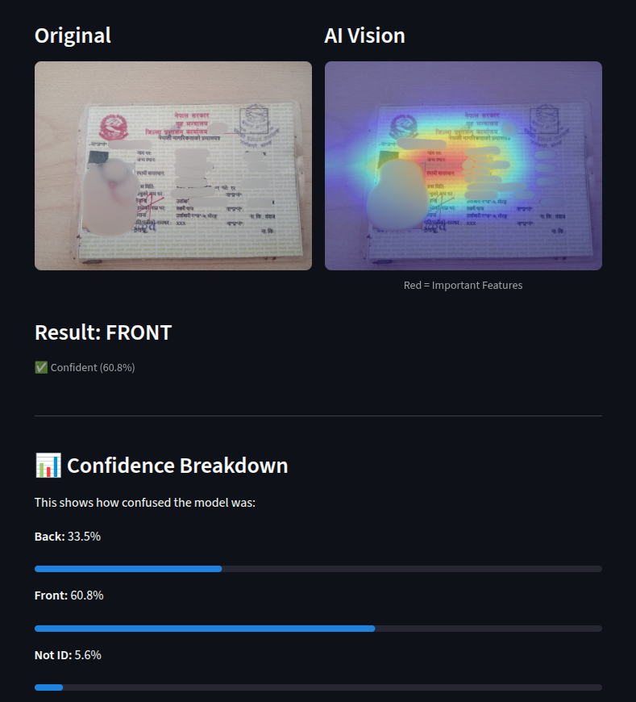
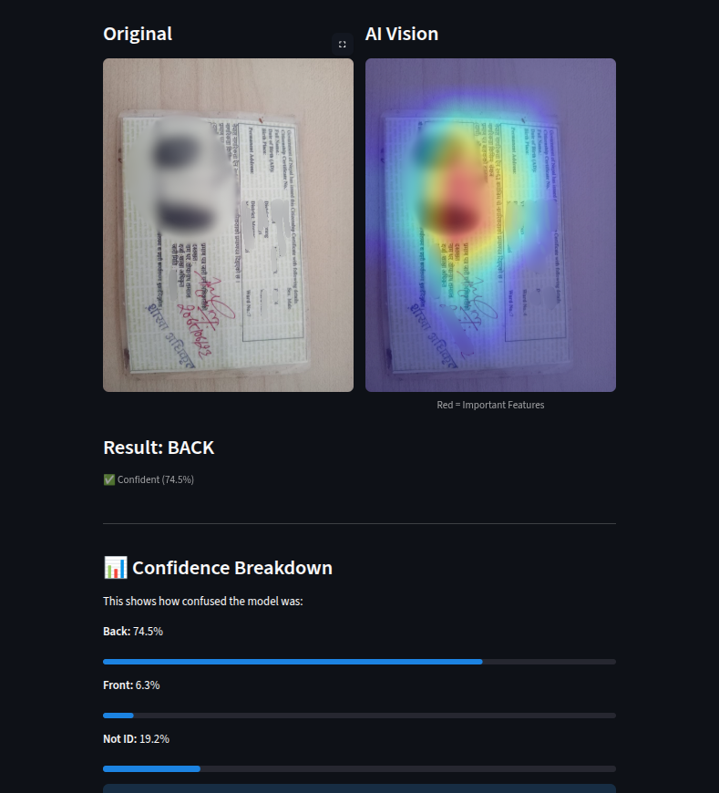
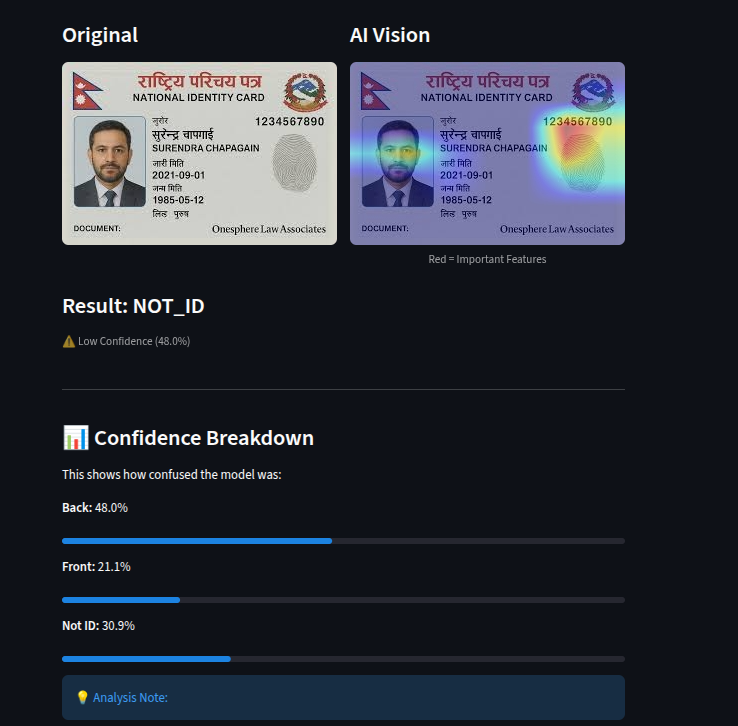

# 🇳🇵 Nepalese Citizenship ID Classifier

A privacy-focused Deep Learning system designed to verify and classify Nepalese Citizenship Cards (Front vs. Back) and reject invalid documents in real-time.

  

## 📖 Project Overview
In e-KYC (Know Your Customer) systems, verifying the authenticity and orientation of documents is critical. This project automates the verification process by classifying images into three categories:
1.  **Front:** Contains the Photo, Name, and Administrative details.
2.  **Back:** Contains the Fingerprints and Address history.
3.  **Not ID:** Random objects, selfies, or irrelevant documents.

## 🔒 Data Privacy & Ethical Considerations
**This repository does not contain any real user data.**

Due to the sensitive nature of **Personally Identifiable Information (PII)** present on Citizenship IDs (Names, DOB, Citizenship Numbers, Fingerprints), strictly **private and non-disclosed data** was used for training. 
*   **Confidentiality:** User privacy was prioritized over dataset size.
*   **No Web Scraping:** No public data scraping was performed to ensure no accidental collection of private data.
*   **Engineering Challenge:** This constraint forced the use of **Few-Shot Learning** techniques to achieve high accuracy (~91%) with very limited data (<30 images per class), simulating a real-world restricted environment.

---

## 🛠️ Engineering Journey (Problems & Solutions)

The primary challenge was building a robust model without access to large-scale data due to privacy constraints.

| Challenge | Cause / Context | The Solution Implemented |
| :--- | :--- | :--- |
| **Data Scarcity (Privacy)** | Strict NDA and PII protection limits data collection to ~27 images per class. | **Transfer Learning:** Used a pre-trained ResNet18 and un-froze specific layers (`layer4`) to learn textures from minimal examples. |
| **Model "Rollercoaster"** | Accuracy fluctuated wildly due to the small sample size. | **Adaptive Learning:** Implemented `AdamW` optimizer + `ReduceLROnPlateau` scheduler to stabilize training and prevent overfitting. |
| **Squashed Images** | Resizing rectangular IDs to square distorted faces/text. | **Square Padding:** Created a custom `SquarePad` algorithm to letterbox images, preserving the geometric aspect ratio. |
| **Orientation Issues** | Users upload IDs vertically/upside down. | **Orientation Invariance:** Applied heavy geometric augmentation (`RandomRotation`, `Perspective`) to teach the model layout independence. |
| **False Positives** | Model confused "White Paper" with "IDs". | **Confidence Thresholding:** Implemented a safety logic to reject predictions with **<75% confidence** and added "Hard Negative" samples. |

---

## 🧠 Technical Architecture

### 1. Preprocessing Pipeline
*   **Input:** Variable resolution images.
*   **Transform:** `SquarePad` (Black borders) → Resize (224x224).
*   **Augmentation:** Gaussian Noise, Color Jitter (Simulating bad cameras).

### 2. Model: ResNet18 (Fine-Tuned)
*   **Backbone:** ResNet18 (Pre-trained on ImageNet).
*   **Strategy:**
    *   **Frozen Feature Extractor:** Early layers kept frozen.
    *   **Unfrozen `Layer 4`:** Allowed to update weights to learn "Fingerprint vs Text" textures.
    *   **Custom Head:** Linear Layer mapping to 3 classes.

### 3. Explainability (Grad-CAM)
*   Integrated **Grad-CAM** to audit the model's decisions.
*   Ensures the model is looking at **Security Features** (Stamps/Fingerprints) and not background noise.

---

## 📊 Results

*   **Training Accuracy:** ~97%
*   **Validation Accuracy:** ~91%
*   **Inference Speed:** Real-time on CPU.

**Visual Proof (Grad-CAM):**
> *The heatmap highlights the User's Photo for 'Front' classification and Fingerprints for 'Back' classification.*






---

## 💻 Installation & Usage

### 1. Clone the Repo
```bash
git clone https://github.com/manjil-budhathoki/nepal-id-classifier
cd nepal-id-classifier
```

### 2. Install Dependencies
```bash
pip install torch torchvision streamlit opencv-python-headless pillow
```

### 3. Setup Dataset
*Note: You must provide your own data following the folder structure below.*
```text
dataset/
    train/
        front/
        back/
        not_id/
    val/
        front/
        back/
        not_id/
```

### 4. Train the Model (Optional)
If you want to retrain on your own data:
```bash
python src/model_training.py
```

### 5. Run the App
Launch the web interface to test images or use the webcam:
```bash
streamlit run src/app.py
```

---

## 📂 Project Structure

```text
├── dataset/               # Training and Validation images
│   ├── train/
│   └── val/
├── src/
│   ├── app.py             # Streamlit Web App (UI)
│   ├── inference.py       # Prediction Logic
│   └── model_training.py  # Training Loop & Model Setup
├── best_model.pth         # Saved Model Weights
└── README.md              # Project Documentation
```

## 🚀 Future Improvements
*   [ ] Collect more "Hard Negative" samples (Random certificates/documents).
*   [ ] Implement OCR to automatically read the Name/Citizenship Number.

---

**Author:** Manjil Budhathoki

